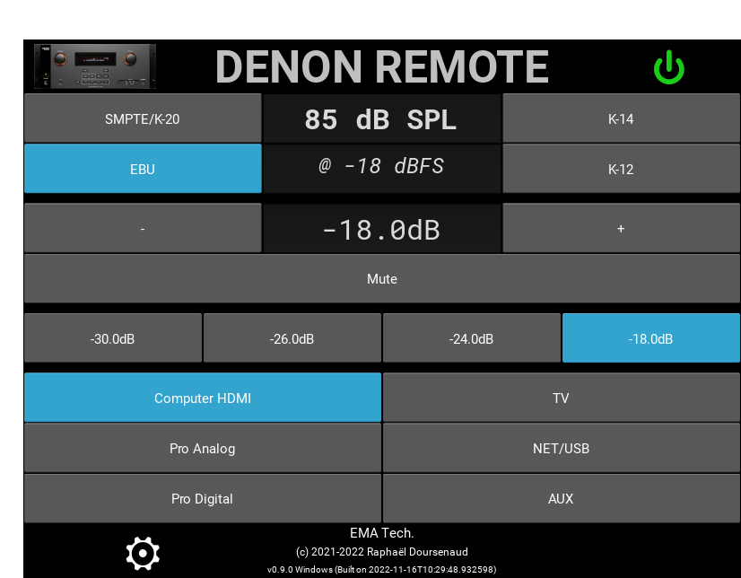
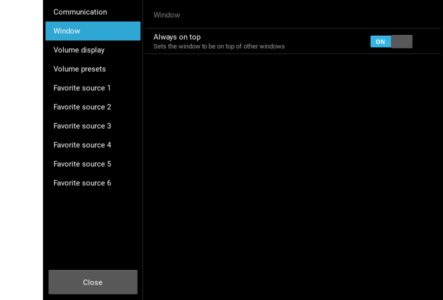

Denon Remote
============

Control [Denon Professional DN-500AV surround preamplifier](https://www.denonpro.com/index.php/products/view/dn-500av)
remotely.

Author: Raphael Doursenaud <rdoursenaud+denonremote@gmail.com>

License: [GPLv3+](LICENSE)

Language: [Python](https://python.org) 3

Fonts used:

- [Unicode Power Symbol](https://unicodepowersymbol.com/) Copyright (c) 2013 Joe Loughry licensed under MIT
- [Free Serif](https://savannah.gnu.org/projects/freefont/) licensed under GPLv3
- [Roboto](https://fonts.google.com/specimen/Roboto) Copyright Christian Robertson licensed under Apache 2.0

### Features

#### Target hardware

- [x] Denon Professional DN-500AV (Seems to be based on the same platform as the Denon AVR-1912 and AVR-2112CI)
- [ ] More? Contributions welcome!

#### Communication

- [x] Ethernet
    - [x] Using [Twisted](https://twistedmatrix.com)
    - [x] connection status detection
    - [x] automatically try to reconnect with exponential backoff
- [ ] RS-232? also using Twisted
- [ ] General MIDI input using [Mido](https://mido.readthedocs.io/en/latest/)
    - [ ] Define control scheme.
      See: [Summary of MIDI 1.0 Messages](https://www.midi.org/specifications-old/item/table-1-summary-of-midi-message)
      , [MIDI 1.0 Control Change Messages](https://www.midi.org/specifications-old/item/table-3-control-change-messages-data-bytes-2)
        - [ ] CC7 = Master Volume
        - [ ] CC120 = Mute
        - [ ] CC? = On/Standby
        - [ ] Program Changes -> Inputs select
            - [ ] Mapping?
    - [ ] Virtual ports
        - [ ] using [loopMidi](http://www.tobias-erichsen.de/software/loopmidi.html) for Windows
        - [ ] rt-midi native for *NIX OSes
        - [ ] rtpMIDI?

#### Controls

- [x] Setup
    - [x] IP address
    - [ ] Serial port?
        - [ ] COM (Windows)
        - [ ] tty (*NIX OSes)
- [x] On/Standby
- [x] Main volume
    - [x] Get
        - [x] Relative
        - [ ] Absolute
    - [x] Set
        - [x] Relative
        - [x] Absolute
    - [x] Mute
- [x] SPL calibrated display
    - [x] EBU/SMPTE RP200: 85dB C SPL @ -18 dBFS (Equivalent to 83 dB C SPL @ -20 dBFS)
    - [x] K meter
        - [x] K-20: -20dBFS = 83dB C SPL (Same as SMPTE and EBU)
        - [x] K-14: -14dBFS = 83dB C SPL
            - [ ] Can be compensated from SMPTE/EBU levels by lowering the output volume by 6dB
        - [x] K-12: -12dBFS = 83dB C SPL
            - [ ] Can be compensated from SMPTE/EBU levels by lowering the output volume by 8dB
    - [x] EBU R 128: -23LUFS (-23dBFS) = 73dB C SPL (Debatable/unclear removed for now)
    - [x] Presets!
        - [x] Relative (-18dB, -24dB…)
        - [ ] Absolute
        - [ ] SPL calibrated
- [ ] Zone 2
- [ ] Per Channel level (Up to 7.1)
- [ ] Tone
- [ ] EQ
- [ ] Sound presets
- [ ] Input select
    - [x] Favorites
- [ ] Security
    - [ ] Panel Lock
    - [ ] IR Remote Lock
- [ ] Settings backup/restore
    - [ ] All
    - [ ] Subsystems?
- [x] Retrieve status
    - [x] Logger
    - [x] Update the GUI
- [ ] Import EQ settings
    - [ ] From [REW](https://www.roomeqwizard.com/) value file
        - [ ] Only use negative values! You can’t compensate a destructive room mode by adding energy to it.
- [ ] Full Profiles/presets?

##### GUI

- [x] Using [Kivy](https://kivy.org)
    - [ ] Keyboard shortcuts:
        - [x] M for Mute
        - [x] Up/Down Vol +/-
        - [ ] Left/Right VolPreset +/-
        - [ ] PgUp/PgDwn SrcPreset +/-
- [x] Systray/Taskbar support using [pystray](https://pypi.org/project/pystray/)
- [x] Only one instance is allowed (Microsoft Windows only)
- [X] Option to make window stay always on top (Microsoft Windows only)
- [x] Touch doesn’t activate the window and doesn’t steal focus (Microsoft Windows only)
- [x] Trigger events without having to activate the window first (Microsoft Windows only)
- [ ] Draw it on the first touch enabled display if available instead of the main one

##### Windows executable

- [ ] Handle shutdown to power off the device
- [x] [PyInstaller](https://www.pyinstaller.org)
    - [x] Generate icon with [IconMaker](https://github.com/Inedo/iconmaker)
    - [x] [UPX](https://upx.github.io/) support
    - How to build:
        - Review [denonremote.spec](denonremote.spec)
        - Use `python -m PyInstaller --clean --upx-dir=c:\upx-3.96-win64 denonremote.spec`
- [ ] [cx-Freeze](https://pypi.org/project/cx-Freeze/) for multiplatform support?
- [ ] VST plugin? (Not required if MIDI input is implemented but would be neat to have in the monitoring section of a
  DAW)
    - [ ] See [PyVST](https://pypi.org/project/pyvst/)

#### Mobile

- [ ] Autonomous mobile app? Kivy enables that!
    - [ ] Android
    - [ ] iOS/iPadOS

#### Proxy/background service?

The receiver only allows 1 active connection. A dispatcher proxy could allow multiple simultaneous remotes (Desktop and
mobile).

### Other opportunities

Open ports:

- 23/tcp (TELNET): BridgeCo AG Telnet server  
  AVR serial protocol used here
- 80/tcp (HTTP): GoAhead WebServer  
  Web control (index.asp) Shows nothing.  
  Most of the useful code is commented!  
  CSS loading at "css/mainMenu.css" times out.  
  Main control is available at "MainZone/index.html"!
- 443/tcp (HTTPS): ERR_SSL_PROTOCOL_ERROR in Google Chrome  
  SSL_ERROR_EXTRACT_PUBLIC_KEY_FAILURE in Mozilla Firefox
- 1026/tcp (RTSP): Apple AirTunes rtspd 103.2
- 6666/tcp: ?
- 8080/tcp (HTTP): AV receiver http config

### Similar projects

Android

- [AVR-Remote](https://github.com/pskiwi/avr-remote)

JavaScript:

- https://github.com/phillipsnick/denon-avr
- https://github.com/murderbeard/com.moz.denon
- https://github.com/jtangelder/denon-remote

PHP

- https://github.com/Wolbolar/IPSymconDenon (IP Symcon automation)

Python:

- https://github.com/jeroenvds/denonremote (XBMC plugin)
- https://github.com/Tom360V/DenonAvr (Similar objectives?)
- https://github.com/toebsen/python-denonavr (HTTP RESTful server)
- https://github.com/MrJavaWolf/DenonPhoneController (Landline phone controller)
- https://github.com/troykelly/python-denon-avr-serial-over-ip (Library)
- https://github.com/auchter/denonavr_serial (Library)
- https://github.com/jphutchins/pyavreceiver (Nice library)
- https://github.com/frawau/aiomadeavr (Library)
- https://github.com/scarface-4711/denonavr (Uses the HTTP/XML interface. Library)
