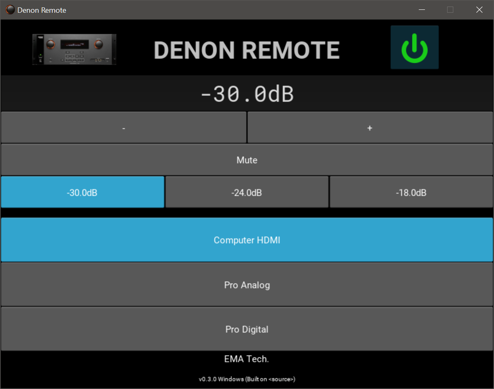

Denon Remote
============

Author: Raphael Doursenaud <rdoursenaud@gmail.com>

License: [GPLv3+](LICENSE)

Language: [Python](https://python.org) 3

Dependencies:

- [Unicode Power Symbol](https://unicodepowersymbol.com/) Copyright (c) 2013 Joe Loughry licensed under MIT

### Features

#### Target hardware

- [x] DN-500AV
- [ ] More? Contributions welcome!

#### Communication

- [x] Ethernet
    - [x] Using [Twisted](https://twistedmatrix.com):
- [ ] RS-232? also using Twisted
- [ ] General MIDI input using [Mido](https://mido.readthedocs.io/en/latest/)
    - [ ] Define control scheme.
      See: [Summary of MIDI 1.0 Messages](https://www.midi.org/specifications-old/item/table-1-summary-of-midi-message)
      , [MIDI 1.0 Control Change Messages](https://www.midi.org/specifications-old/item/table-3-control-change-messages-data-bytes-2)
        - [ ] CC7 = Master Volume
        - [ ] CC120 = Mute
        - [ ] CC? = On/Standby
        - [ ] Program Changes -> Inputs select
            - [ ] Mapping?
    - [ ] Virtual ports
        - [ ] using [loopMidi](http://www.tobias-erichsen.de/software/loopmidi.html) for Windows
        - [ ] rt-midi native for *NIX OSes
        - [ ] rtpMIDI?

#### Controls

- [ ] Setup
    - [x] IP address
    - [ ] Serial port?
        - [ ] COM (Windows)
        - [ ] tty (*NIX OSes)
- [x] On/Standby
- [x] Volume control
    - [x] Get
        - [x] Relative
        - [ ] Absolute
    - [x] Set
        - [x] Relative
        - [x] Absolute
    - [x] Mute
    - [x] Presets! (-18dBFS, -24dBFS…)
    - [ ] SPL calibrated display (-18dBFS = 85dBSPL)
- [ ] Input select
- [ ] Security
    - [ ] Panel Lock
    - [ ] IR Remote Lock
- [ ] Settings backup/restore
    - [ ] All
    - [ ] Subsystems?

- [x] Retrieve status
    - [x] Logger
    - [x] Update the GUI

- [ ] Profiles/presets?

- [ ] Import EQ settings
    - [ ] From [REW](https://www.roomeqwizard.com/) value file

##### GUI

- [x] Using [Kivy](https://kivy.org)

##### Windows executable

- [x] Find a way to make it resident in the task bar with a nice icon, like soundcard control panel
    - [x] [RBTray](https://sourceforge.net/projects/rbtray/files/latest/download)
    - [ ] The Pythonic Way
- [ ] Handle shutdown to power off the device
- [x] PyInstaller
    - [x] Generate icon with [IconMaker](https://github.com/Inedo/iconmaker)
    - [x] [UPX](https://upx.github.io/) support
    - How to build:
        - Review [denonremote.spec](denonremote.spec)
        - Use `python -m PyInstaller denonremote.spec --upx-dir=c:\upx-3.96-win64`
- [ ] VST plugin? (Not required if MIDI input is implemented but would be neat to have in the monitoring section of a
  DAW)
    - [ ] See [PyVST](https://pypi.org/project/pyvst/)

#### Mobile

- [ ] Autonomous mobile app? Kivy enables that!
    - [ ] Android
    - [ ] iOS/iPadOS